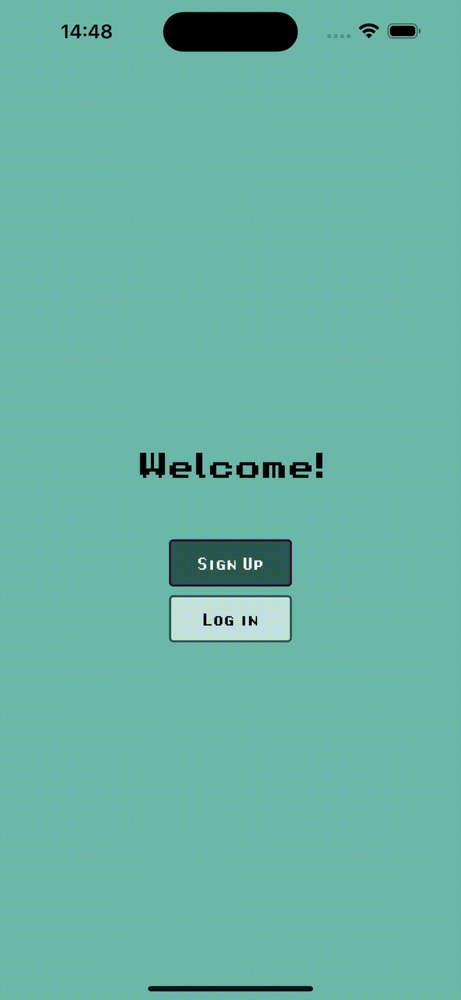
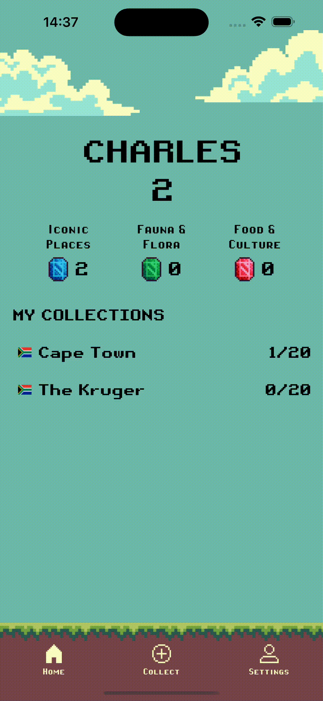

# Collectibles App

## Description

Real-world collectibles of places ⛰️, plants 🌷, animals 🦁, and food 🍷.
Get out into the world, collect them all, increase your high score!

## Table of Contents

- [Description](#description)
- [Features](#features)
- [Screenshots](#screenshots)
- [Dependencies](#dependencies)
- [Stack](#stack)
- [Deployment](#deployment)


## Features

- 🚠 View collectibles
- 📸 Upload image and text
- 💯 Track your high score
- 👨‍🔧 Update username & password
- 🔐 Authenticate users securely

## Screenshots

### Signup:



### View collection:


### Add collectible:


### Change username:



## Stack

**UI/UX:** Figma

**Frontend:** React Native (./Collectibles.Frontend)

**Backend:** ASP.NET Web API (./Collectibles.Backend)

**Infrastructure:** AWS App Runner (./Collectibles.Infrastructure)

## Dependencies

- AWS CLI 
- CDK CLI 
- Expo

## Deployment

### Deploy Backend to AWS App Runner

```bash
# Navigate to the infrastructure project
cd Collectibles.Infrastructure

# Build the CDK project
dotnet build src/Collectibles.Infrastructure.Stack/Collectibles.Infrastructure.Stack.csproj -c Release

# Bootstrap (only needed on initial deployment)
cdk bootstrap

# Deploy the CDK stack
cdk deploy

# Destroy the CDK stack
cdk destroy
```

### Run Frontend In Expo

```bash
# Navigate to the frontend project
cd Collectibles.Frontend/collectibles/

# Copy your CDK stack's BASE URL output to the environment variable in your .env file:
EXPO_PUBLIC_BASE_URL=<copied base URL>

# Start the Expo development server
npx expo start --localhost
```


